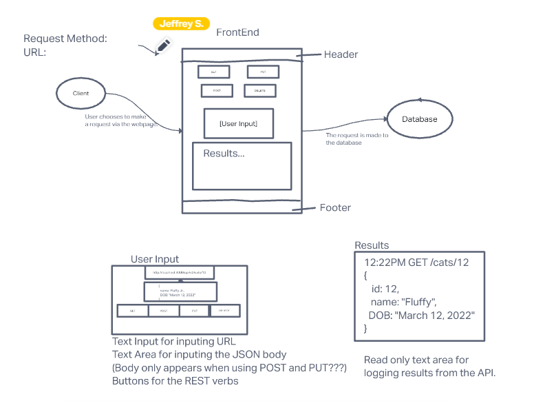

# Component Based UI

## Lab Requirements

## Phase 1

Students will be creating and styling a Counter application. Look for the following attributes

- `Header`, `Footer`, and `Counter` components to separate files
- Properly `export` them as defaults
- Import them into the `App` Component using ES6 `import` statement
- Proper state management
- Button Handlers
  - Bonus if they can wire both buttons with one handler

### Grading Standards & Notes

- Features
  - As noted
- Code Quality
  - Looking for proper class syntax.
  - Good file naming and folder structure.
  - Styles well written, using SASS variables/nesting and thought through beyond simple colors.
- Testing
  - Not Required
- Deployment
  - Code Sandbox only.
- Documentation
  - Quality README

### Lab Assistance Notes

- The first and most important part of the lab assignment is to draw a process diagram of the starter code and state as events happen. Once the students understand that, they can move on.

## Phase 2

In phase 2, we will be receiving user input in preparation of connecting to live APIs, using the useState() hook in our functional components. In order to properly manage state with the useState hook, we will now convert App.js to a functional component.

The following user stories detail the major functionality for this phase of the project.

As a user, I want to enter the REST Method and URL to an API
As a user, I want to see a summary of my request as well as results returned from an API request in my browser in a readable format

## Phase 3

In phase 3, we will be connecting RESTy to live APIs, fetching and displaying remote data. Our primary focus will be to service GET requests

The following user stories detail the major functionality for this phase of the project.

As a user, I want to enter the URL to an API and issue a GET request so that I can retrieve it's data As a user, I want to see the results returned from an API request in my browser in a readable format Application Flow:

User enters an API URL Chooses a REST Method Clicks the "Go" button Application fetches data from the URL given, with the method specified Displays the response headers and results separately Both headers and results should be "pretty printed" JSON

## Phase 4
In phase 4, we will be tracking every API call and storing it in history

The following user stories detail the major functionality for this phase of the project.

As a user, I want to see a list of my previous API calls, so that I can see the results again, quickly Application Flow:

User enters an API URL Chooses a REST Method Clicks the "Go" button Application fetches data from the URL given, with the method specified Application stores the API request and returned data into state Updates the list of previous API calls Application Displays the response headers and results separately Both headers and results should be "pretty printed" JSON

Deplyoed website: https://alfredo-resty.netlify.app/
